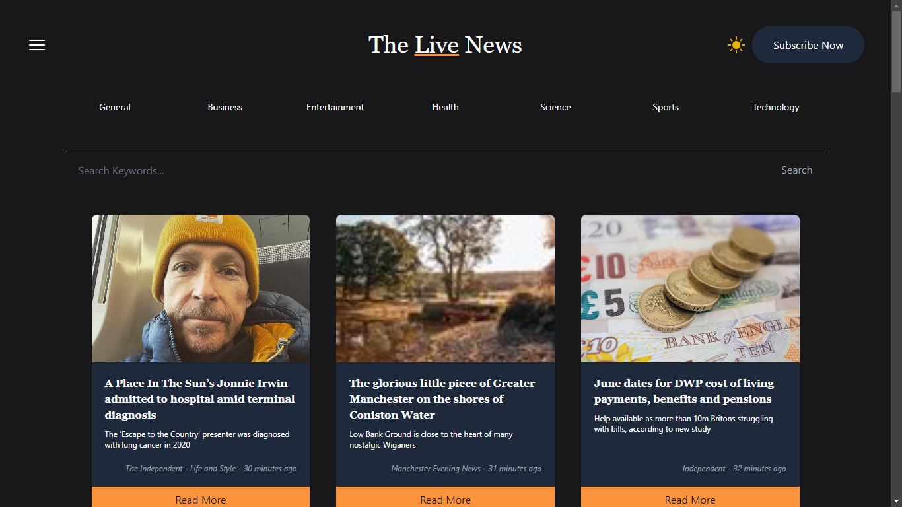
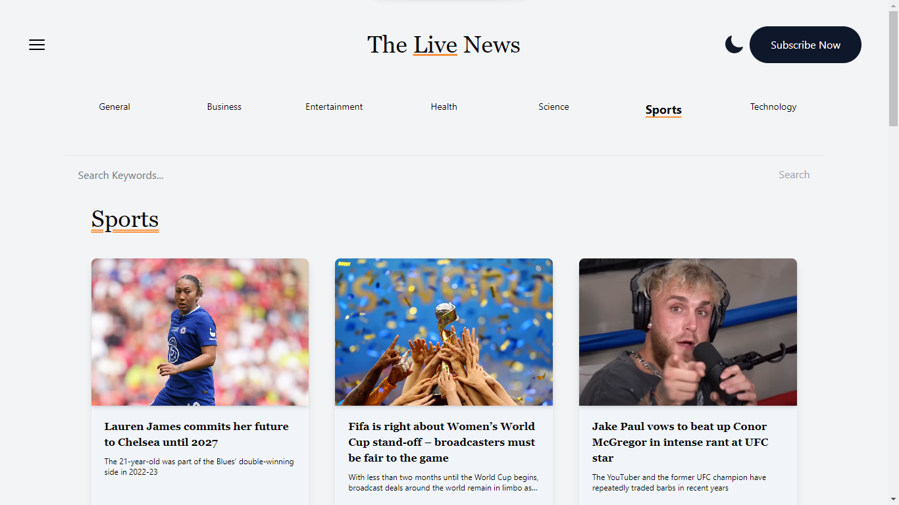

# NewsX

**This is the upgraded version of NewsX**    
**[[Preview]: news--x.vercel.app ](https://newsx--vercel.app)**

- This a news app created with the following stack:
  1. React/NextJs
  2. Typescript
  3. TailwindCSS
  4. Mediastack news api

**The legacy code has been moved to legacy code branch.**

## Screenshot

